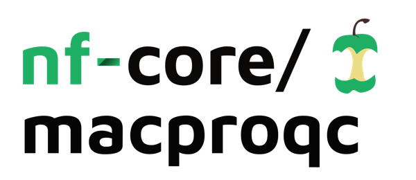

<h1>
  <picture>
    <source media="(prefers-color-scheme: dark)" srcset="docs/images/nf-core-macproqc_logo_dark.png">
    
  </picture>
</h1>

[](https://github.com/codespaces/new/nf-core/macproqc)
[](https://github.com/mpc-bioinformatics/McQuaC/actions/workflows/nf-test.yml)
[](https://github.com/mpc-bioinformatics/McQuaC/actions/workflows/linting.yml)

[](https://www.nextflow.io/)
[](https://github.com/nf-core/tools/releases/tag/4.0.2)
[](https://docs.conda.io/en/latest/)
[](https://www.docker.com/)
[](https://sylabs.io/docs/)

[](https://nfcore.slack.com/channels/macproqc)[](https://bsky.app/profile/nf-co.re)[](https://mstdn.science/@nf_core)[](https://www.youtube.com/c/nf-core)

## Introduction

**nf-core/macproqc** (**Ma**ss **C**entric **Pro**teomics **Q**uality **C**ontrol) is a bioinformatics pipeline for comprehensive quality control of mass spectrometry-based proteomics experiments. It accepts raw instrument files from Thermo Fisher (`.raw`) and Bruker (`.d`) instruments as well as pre-converted mzML files and produces a rich set of QC metrics, interactive visualisations, and standardised [mzQC](https://hupo-psi.github.io/mzQC/) output.

The pipeline performs the following main steps:

- **Spectra preparation** - raw vendor files are decompressed and converted to the open mzML format using ThermoRawFileParser (Thermo) or tdf2mzml (Bruker).
- **Raw-data QC metrics extraction** _(migrating)_ - MS1/MS2 spectrum counts, TIC quartiles, precursor charge distributions, retention-time coverage and more are extracted from the mzML files using pyOpenMS.
- **Peptide identification** _(migrating)_ - MS2 spectra are searched against a user-supplied FASTA database, without and if necessary with label information.
- **FDR filtering and protein inference** _(migrating)_ - PSM-level results are filtered at 1 % FDR and protein groups are inferred with PIA - Protein Inference Algorithms.
- **QC metrics for peptide features** _(migrating)_ - OpenMS identifies isotope features; found features are mapped to identifications to yield identification rates and QC metrics are extracted.
- **mzQC output** _(migrating)_ - all QC metrics are exported in the standardised [mzQC](https://hupo-psi.github.io/mzQC/) format for interoperability.
- **Visualisation** _(migrating)_ - an interactive report with barplots, TIC overlays, ion maps and PCA plots is generated using Plotly.

## Usage

> [!NOTE]
> If you are new to Nextflow and nf-core, please refer to [this page](https://nf-co.re/docs/get_started/environment_setup/overview) on how to set-up Nextflow. Make sure to [test your setup](https://nf-co.re/docs/get_started/run-your-first-pipeline) with `-profile test` before running the workflow on actual data.

First, prepare a samplesheet with your input data:

`samplesheet.csv`:

```csv
sample,spectrum_file
msrunone,/path/to/data/CONTROL_REP1.raw
msruntwo,/path/to/data/CONTROL_REP2.d.tar.gz
msrunthree,/path/to/data/CONTROL_REP3.mzML.gz
```

Each row represents one MS run. The `spectrum_file` column accepts Thermo `.raw`, Bruker `.d` directory archives (optionally compressed), and mzML files - all supporting `.gz`, `.zip`, or `.tar.gz` compression.

Now, you can run the pipeline using:

```bash
nextflow run nf-core/macproqc \
   -profile docker \
   --input samplesheet.csv \
   --outdir ./results
```

> [!WARNING]
> Please provide pipeline parameters via the CLI or Nextflow `-params-file` option. Custom config files including those provided by the `-c` Nextflow option can be used to provide any configuration _**except for parameters**_; see [docs](https://nf-co.re/docs/running/run-pipelines#using-parameter-files).

For more details and further functionality, please refer to the [usage documentation](https://mpc-bioinformatics.github.io/McQuaC/usage/) and the [parameter documentation](https://mpc-bioinformatics.github.io/McQuaC/parameters).

## Pipeline output

For more details about the output files and reports, please refer to the [output documentation](https://mpc-bioinformatics.github.io/McQuaC/output/).
Update these paths information!

## Credits

nf-core/macproqc was originally written by Julian Uszkoreit, Dirk Winkelhardt, Karin Schork, Maike Weber, and Dominik Lux at the Ruhr University Bochum.

We thank the following people for their extensive assistance in the development of this pipeline:

<!-- TODO nf-core: If applicable, add a list of additional contributors here -->

## Contributions and Support

If you would like to contribute to this pipeline, please see the [contributing guidelines](docs/CONTRIBUTING.md).

For further information or help, don't hesitate to get in touch on the [Slack `#macproqc` channel](https://nfcore.slack.com/channels/macproqc) (you can join with [this invite](https://nf-co.re/join/slack)).

## Citations

<!-- TODO nf-core: Add citation for pipeline after first release. Uncomment lines below and update Zenodo doi and badge at the top of this file. -->
<!-- If you use nf-core/macproqc for your analysis, please cite it using the following doi: [10.5281/zenodo.XXXXXX](https://doi.org/10.5281/zenodo.XXXXXX) -->

An extensive list of references for the tools used by the pipeline can be found in the [`CITATIONS.md`](CITATIONS.md) file.

The pipeline is based on the KNIME workflow published in:

> Rozanova S, Uszkoreit J, Schork K, Serschnitzki B, Eisenacher M, Tönges L, Barkovits-Boeddinghaus K, Marcus K. **Quality Control-A Stepchild in Quantitative Proteomics: A Case Study for the Human CSF Proteome.** _Biomolecules._ 2023 Mar 7;13(3):491. doi: [10.3390/biom13030491](https://doi.org/10.3390/biom13030491). PMID: 36979426; PMCID: PMC10046854.

Some of the QC metrics implemented in this pipeline are based on:

> Bittremieux W, Meysman P, Martens L, Valkenborg D, Laukens K. **Unsupervised Quality Assessment of Mass Spectrometry Proteomics Experiments by Multivariate Quality Control Metrics.** _J Proteome Res._ 2016 Apr 1;15(4):1300-7. doi: [10.1021/acs.jproteome.6b00028](https://doi.org/10.1021/acs.jproteome.6b00028). PMID: 26974716.

You can cite the `nf-core` publication as follows:

> **The nf-core framework for community-curated bioinformatics pipelines.**
>
> Philip Ewels, Alexander Peltzer, Sven Fillinger, Harshil Patel, Johannes Alneberg, Andreas Wilm, Maxime Ulysse Garcia, Paolo Di Tommaso & Sven Nahnsen.
>
> _Nat Biotechnol._ 2020 Feb 13. doi: [10.1038/s41587-020-0439-x](https://dx.doi.org/10.1038/s41587-020-0439-x).
