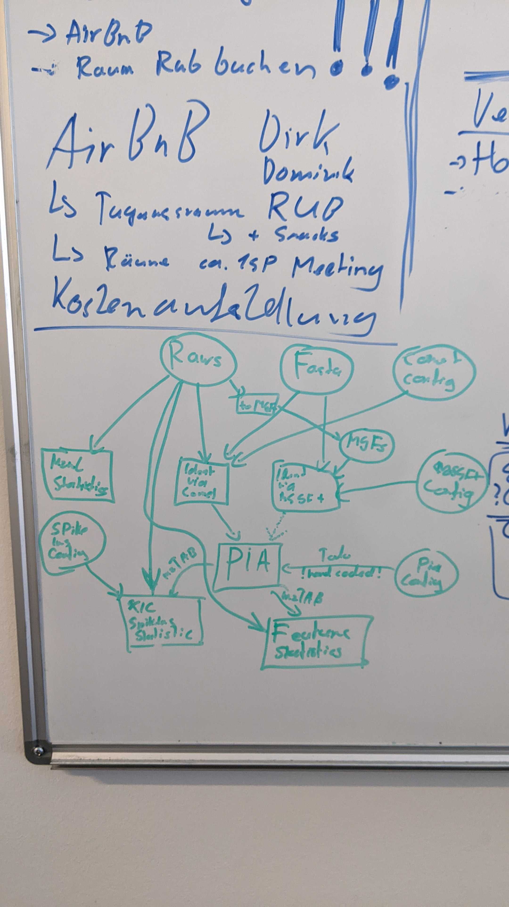

# Documentation for the Nextflow QC workflow

This workflow does quality control for DDA mass spectrometry proteomics data. 
The workflow can be used in two different modes: for ISA runs (is_isa = TRUE) or normal runs (is_isa = FALSE).

Some metrics are based on the following paper:
Bittremieux W, Meysman P, Martens L, Valkenborg D, Laukens K. Unsupervised Quality Assessment of Mass Spectrometry Proteomics Experiments by Multivariate Quality Control Metrics. J Proteome Res. 2016 Apr 1;15(4):1300-7. doi: 10.1021/acs.jproteome.6b00028. Epub 2016 Mar 18. PMID: 26974716.

## Input: 

- raw files (TODO: from where?)
- FASTA file(s) (TODO: from where?)
- Config files for Comet, MSGF+ and PIA (TODO: from where?, are they fixed or dynamically generated from user input?)
- List with spike-ins (only for ISA runs)

## Output:
- A table with quality control metrics is saved to the database.
- Figures for parts of these metrics are created.

## General workflow:
- **Data input**: TODO
- **Raw data metrics**: Raw files are converted to mzML, then different metrics are collected and calculated (e.g., number of MS1 and MS2 spectra, TICs, precuror charges).
- **Peptide identification**: The MS2 spectra in the raw files are identified using the Comet and the MSGF+ search engines using the provided FASTA files.
- **FDR filtering and protein inference**: The results from Comet and MSGF+ are further analysed by PIA (aggregating the results of the two search engines, filter for FDR and performing protein inference). PIA creates a mzTab file, that is further processed.
- **Spike-ins**: Only for ISA: Identifications and XIC for a specific list of spike-ins are searched in the mzTab and the corresponding 
- **Feature finding**: Using OpenMS FeatureFinder to find features and get metrics like total and identified number of features.
- **Saving metrics to database**: The output table is saved to the database.
- **Plotting**: In a separate step, information is retrieved from the data base and plots are created (barplots for various metrics, PCA plots and TIC overlay).

*TODO: make the workflow graph nicer*.

## Details

### 1) **Data input**

### 2) **Raw data metrics**
Sub-workflow: get_mzml_chromatogram_and_more.nf

The raw files are first converted to mzML using the ThermoRawFileParser with peak picking. The Python script extract_data_from_mzml.py uses the pyopenms package to calculate various metrics like number of MS1 and MS2 spectra, information on retention time and TIC, precursor charge states etc.
For details on the different metrics see the QC_columns_overview.csv table.

### 3) **Peptide identification**
Sub-workflows: identification_via_comet.nf and identification_via_msgfplus.nf  

The MS2 spectra in the raw files are identified via the Comet and MSGF+ search engines using the provided FASTA files.

For Comet, a configuration file (example_configurations/high-high.comet.params) is needed, which contains the necessary parameters. 
By default, peptide mass tolerance is set to 5ppm, fragment tolerance as 20ppm, maximum 2 missed cleavages and Trypsin as the enzyme.
Oxidation(M) is set as a variable modification and Cabamidomethylation (C) as a fixed modification.

For MSGF+ (under construction), the configuration file example_configurations/msgfplus_config.txt is used. Raw files have to be converted to MGF files via the ThermoRawFileParser before identification.
By default, instrument type is set to high-resolution, fragment tolerance as 20ppm, unlimited number of missed cleavages and Trypsin as the enzyme.
Oxidation(M) is set as a variable modification and Cabamidomethylation (C) as a fixed modification.

### 4) **FDR filtering and protein inference**
Sub-Workflow: pia.nf

For FDR estimation and protein inference, the CLI version of PIA is used.
The idXML files from the identification steps are used and processed using PIA compilation and analysis.

The PIA results are then given as a piaExport-PSMs.mzTab, piaExport-peptides.csv and piaExport-proteins.mzid.

From these files, also metrics like the number of identified proteins, proteingroups, PSM charges and missed cleavages are calculated (TODO!).

*Are the results of Comet and MSGF+ also combined here?*

### 5) **Spike-ins**
Sub-Workflow: retrieve_spike_ins_thermorawfileparser.nf

For ISA files only, metrics for a set of predefined spike-in peptides can be calculated (see QC_columns_overview.csv).
For this, the spike-in peptides have to be included in the corresponding FASTA file. 
The list of currently used spike-ins is given in spike_ins.csv.
Using ThermoRawFileParser is used to retrieve the XICs within 10ppm m/z window and +/- 3 min retention time window of the expected spike-in values.
From the output of ThermoRawFileParser we aquire the following information for each spike-in:
- FIXED_MPCSPIKEX_PEP_XXX_RT_XXX -> Sum of all peaks measured inside the expected spike-in window (10 ppm m/z-tolerance and +/- 3 min retention time window).
- IDENT_MPCSPIKEX_COUNT -> spectral count for the given peptide sequence.
- IDENT_MPCSPIKEX_DELTA_RT -> difference between expected and measured retention time for the specific spike-in (if peptide was identified).
- IDENT_MPCSPIKEX_PEP_XXX_RT_DELTA -> Sum of XIC for the identified PSMs.

### 6) **Feature Finding**
Sub-workflow. get_features_in_raws.nf

The raw files are converted to mzML (*Why don't we use the mzMLs from step 2?*) using ThermoRawFileParser. Then, the OpenMS FeatureFinderCentroided is used to find the features. The OpenMS IDmapper is used to match the found features with the identifications (mzTabs acquired from PIA). The resulting feature.xml file is then used to calculate further metrics like total number of features, charge state of features etc. (see QC_columns_overview.csv) .

### 7) **Saving results to database**
*TODO!*

### 8) **Plotting**
The visualization is done in Python with the plotly package for interactive plots.

The data stem from the different tables in the database. As parameters only the names of the raw files to plot have to be given. In case of regular QC, groups can be defined for colouring the PCA plots. If use_groups = False, the PCA plots will be coloured by timestamp, so that effects of the run order can be assessed.

List of plots (regular QC):

- Figure 0: Show table with all QC metrics (TODO)
- Figure 1: Barplot for total number of MS1 and MS2 spectra (absolute numbers)
- Figure 2: Barplot for number of PSMs, peptides, proteins and identified features (absolute numbers)
- Figure 3: TIC Overlay as Lineplot
- Figure 4: Barplot TIC quartiles
- Figure 5: Barplot MS1 TIC quartiles
- Figure 6: Barplot MS2 TIC quartiles
- Figure 7: Barplot of precursor charge states (relative)
- Figure 8: Barplot of PSM charge states (of identified spectra) (relative)
- Figure 9: Barplot of missed cleavages of PSMs (relative)
- Figure 10: PCA on all data (a) (+ plot for Loadings (b) (to assess importance of variables for the PCA))
- Figure 11: PCA on raw data (a) (+ plot for Loadings (b) (to assess importance of variables for the PCA))
- Figure 12: For each raw files, an ion map (2D density plot with x = RT, y = MZ)
- Figure 13: Time vs. pump pressure (Lineplot)
- Figure 14: Time vs. ion injection time (Lineplot)
- Figure 15: Time vs. Lock mass correction (ppm) (Lineplot)

In the QC_columns_overview.csv table it is indicated which columns are used inside the two PCA plots.

List of plots (ISA QC):

- Figure 0: Show table with important ISA QC metrics (TODO, this corresponds to the run_data table)
- Figure 1: Barplot with number of proteins, protein groups and unfiltered protein groups (absolute numbers)
- Figure 2: Barplot with number of peptides (absolute numbers)
- Figure 3: Barplot with number of PSMs (absolute numbers)

